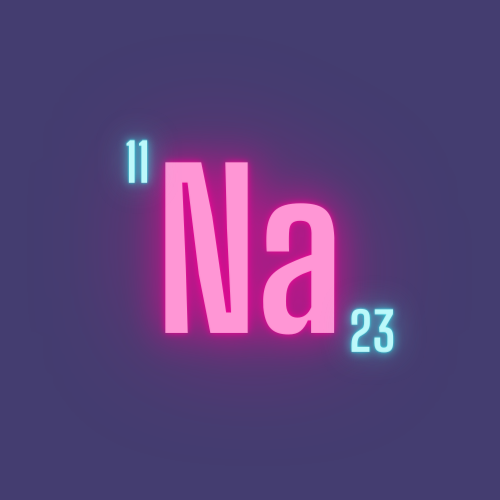

<p align="center">
  <a href="https://github.com/sohamsshah/sodium-ui" rel="noopener" target="_blank"></a></p>
</p>

<h1 align="center"><b>Sodium UI Docs</b></h1>

## Introduction

**Sodium UI** is a Web-component library for swiftly developing elegant React Applications.  

The site is hosted at: https://sodium-ui.netlify.app/
The Web Components Site is hosted at: https://sohamsshah.github.io/sodium-ui/

## Installation
To build the documentation locally:
```
cd ./sodium-ui-docs
npm install
npm start
```

## **We love Contributions** 💖
**Sodium UI** is truly Open Source. Any sort of contribution to this project are highly appreciated. 
Contributions are welcomed for the docsite as well as in [Sodium UI]() library. Read the [Contributing Guideline](/CONTRIBUTING.md) to learn more on how to setup development environment, propose bug fixes or improvements and how to build and test your changes to Sodium UI. 

## **License** 

This project is licensed under the terms of the
[MIT license](/LICENSE)
